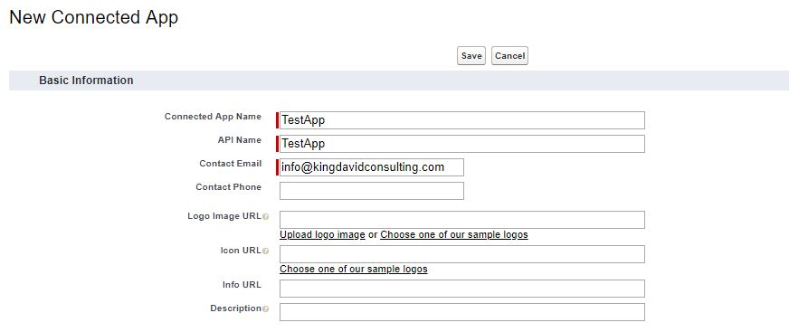
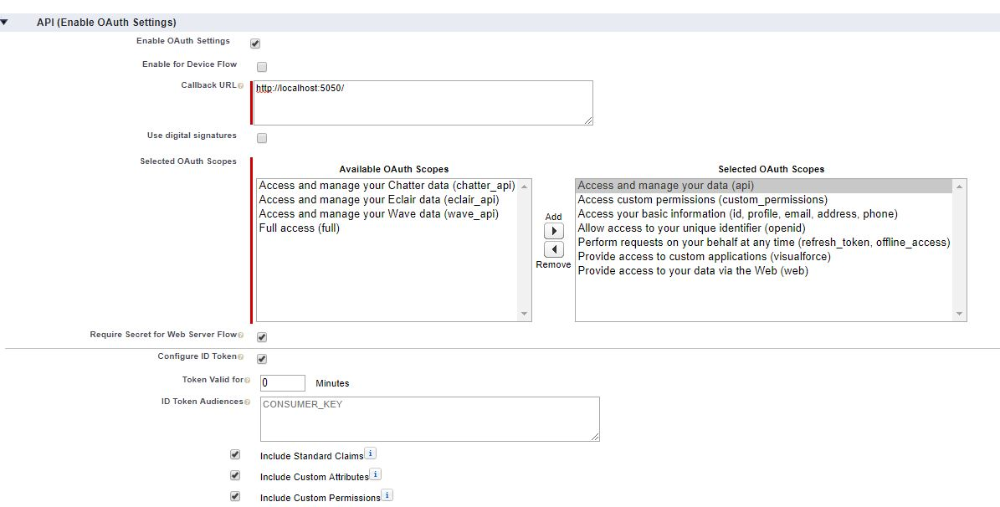
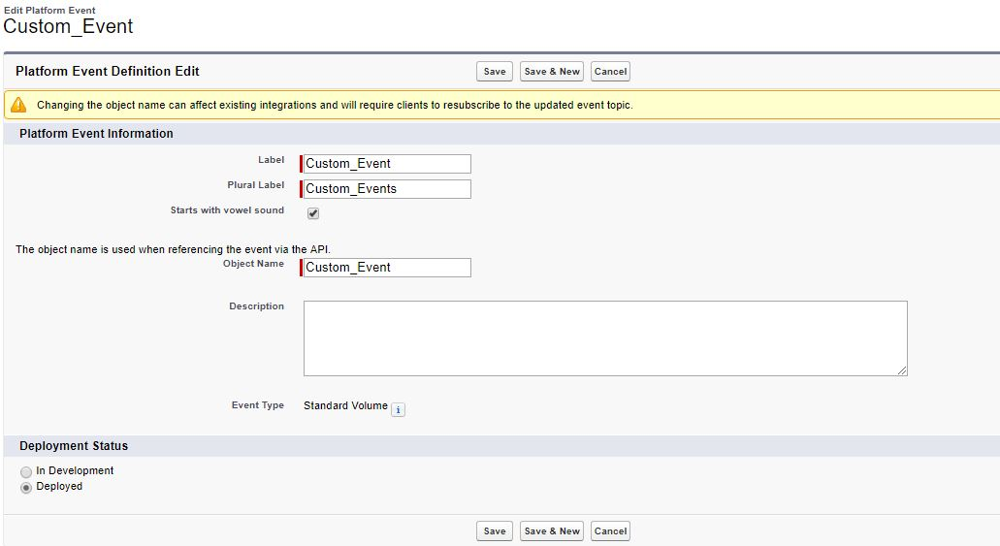
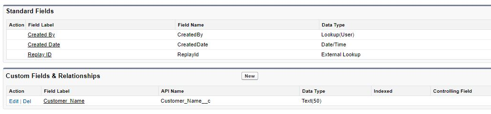

# CometD .NET Core implementation of Salesforce Platform events

[](https://ci.appveyor.com/project/kdcllc/cometd-netcore-salesforce)

This repo contains the CometD .NET Core implementation for Salesforce Platform events.
 
These events can be subscribed to and listened to by your custom `Event Listener`. The sample application of this library can be found [here](https://github.com/kdcllc/Bet.BuildingBlocks.SalesforceEventBus).

The solution contains the following:

1. `CometD.NetCore2.Salesforce` Project
     - A Salesforce Platform Events implementation based [Even Bus idea of eShopOnContainers](https://github.com/dotnet-architecture/eShopOnContainers).
     - [Reusable Building Blocks and sample application that listens to Salesforce push events](https://github.com/kdcllc/Bet.BuildingBlocks.SalesforceEventBus).

2. DotNet Cli tool `salesforce` Project
   - This dotnet cli tool allows for retrieval of `Access Token` and `Refresh Token` to be used by any other application. Please refer to [How Are Apps Authenticated with the Web Server OAuth Authentication Flow](https://developer.salesforce.com/docs/atlas.en-us.api_rest.meta/api_rest/intro_understanding_web_server_oauth_flow.htm)

## Installation

- To include this library inside of your project run nuget package installation

```cmd
    PM> Install-Package CometD.NetCore2.Salesforce
```

Or

```cmd
     dotnet add package CometD.NetCore.Salesforce
```

- To Install Salesforce Cli tool globally run the following command:

```cmd
 dotnet tool install salesforce -g

```

To verify the installation run:

```cmd
 dotnet tool list -g
```

## Usage of Salesforce dotnet cli tool

There are several ways to run this cli tool.

1. From any location with Consumer Key and Secret provided

```bash
    salesforce get-tokens --key:{key} --secret:{secret} --login:https://login.salesforce.com --verbose:information
```

2. Running the tool in the directory that contains `appsettings.json` file

```bash
    salesforce get-tokens --section Salesforce
```
Note: required configurations are as follows:

```json
  "Salesforce": {
    "ClientId": "",
    "ClientSecret": "",
    "LoginUrl": ""
  }
````

3. Running with Azure Vault

`appsettings.json
```json
    "AzureVault": {
     "BaseUrl": "https://{name}.vault.azure.net/"
    },
```

Then run:

```cmd
    salesforce get-tokens --verbose:debug
```

Or specify url within the dotnet cli tool like so:

```cmd
    salesforce get-tokens --azure https://{name}.vault.azure.net/"
```

This tool will open web browser and will require you to log in with your credentials to Salesforce portal in order to retrieve the tokens.

## Saleforce Setup
[Video](https://www.youtube.com/watch?v=L6OWyCfQD6U)
1. Sing up for development sandbox with Saleforce: [https://developer.salesforce.com/signup](https://developer.salesforce.com/signup).
2. Create Connected App in Salesforce.
3. Create a Platform Event.

### Create Connected App in Salesforce
1. Setup -> Quick Find -> manage -> App Manager -> New Connected App.
2. Basic Info:



3. API (Enable OAuth Settings):


4. Retrieve `Consumer Key` and `Consumer Secret` to be used within the Test App

### Create a Platform Event
1. Setup -> Quick Find -> Events -> Platform Events -> New Platform Event:



2. Add Custom Field



(note: use sandbox custom domain for the login to workbench in order to install this app within your production)

Use workbench to test the Event [workbench](https://workbench.developerforce.com/login.php?startUrl=%2Finsert.php)
## AuthApp
[Use login instead of test](https://github.com/developerforce/Force.com-Toolkit-for-NET/wiki/Web-Server-OAuth-Flow-Sample#am-i-using-the-test-environment)
Simple application that provides with Web Server OAuth Authentication Flow to retrieve 
`Access Token` and `Refresh Token` to be used within the application.

## Special thanks to the following projects and contributors:
- [Oyatel/CometD.NET](https://github.com/Oyatel/CometD.NET)
- [nthachus/CometD.NET](https://github.com/nthachus/CometD.NET)
- [tdawgy/CometD.NetCore](https://github.com/tdawgy/CometD.NetCore)
- [eShopOnContainers](https://github.com/dotnet-architecture/eShopOnContainers)
- [Chris Woolum](https://github.com/cwoolum)
